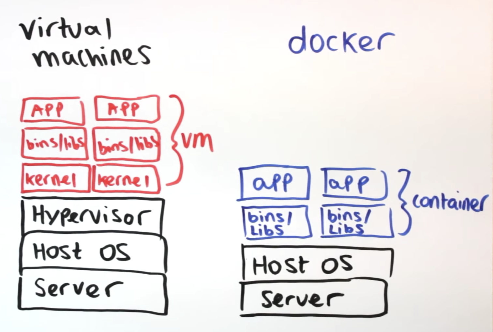
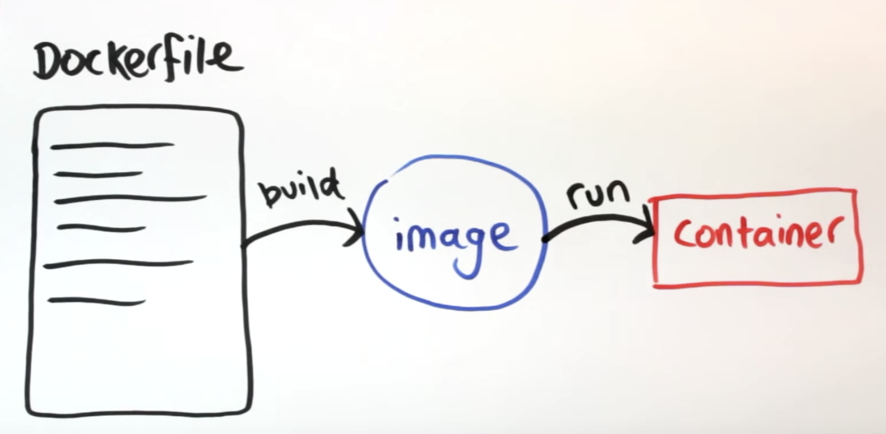

# Docker & Django


## 🐳 Django & Docker Concepts

[1. Django conference Docker explanation](https://www.youtube.com/watch?v=v5jfDDg55xs)

[1-1. Docker Resources](https://github.com/williln/docker-hogwarts)

[2.Learn Docker in 12 Minutes by Jake Wright](https://www.youtube.com/watch?v=YFl2mCHdv24)

*  Docker General Explanation

  1. Same Environment
  2. Sandbox projects (no conflict between projects)
  3.  Good for coworking

* Virtual Machines vs. Docker
  

* Introduction to Dockerfiles, images and containers
  

  Use dockerfile to tell docker how to build your image, where image runs project in a container

  * Container: running instance of an image (NOT REPOSITORY!)
  * Image: Template of bundles for OS, software, application code
  * Dockerfile: File that builds Image & defines specifics of project

* Writing a Dockerfile
  
  * Writing as shell command such as FROM, COPY, EXPOSE...

### Sample docker file & docker commands

```dockerfile
# Getting python file from docker hub
FROM python: 3.6

# getting environment variable on console
ENV PYTHONNUNBUFFERED 1

# copying local file into container's /code/ directory
COPY ./requirements.txt /code/requirements.txt
RUN pip install -r /code/requirements.txt

# copying the rest of the files into container's /code/ directory
# container's working directory is /code/
COPY . /code/
WORKDIR /code/

#Exposing port to 8000
EXPOSE 8000

# Python commands
# This part can be removed when commands are configured at .yaml file
CMD ["python", "./manage.py", "runserver", "0.0.0.0:8000", "--settings=mysite.settings"]
```

Build the image, 
or Build image with name tag

```shell
docker build .
```

```shell
docker build -t fitcuration .
```

Docker commands to look at images & container

```shell
docker images
```

Actualize container by running the image 
-> docker run publish image
-> take container's port 8000 to publish it to local's 8000
-> name of the image that your container want to base on

```shell
docker run -p 8000:8000 fitcuration
```

Check container's status

```shell
docker container ls
```

[Explore bash command in running instance of container](https://youtu.be/v5jfDDg55xs?t=1212)

```shell
docker exec -it <container-id> /bin/bash
```

- Ctrl + D to get out of container

Pause container or restart container: you don't have to build rebuild the image

```shell
docker stop <container-id>
docker start <container-id>
```

Blow container away. But remember, image is still there.

```shell
docker kill <container-id>
```

### Sample docker-compose (.yaml)

- docker-compose is a tool that abbreviates docker commands
- It can run several containers at once

```yaml
#compose syntax version. NOT PYTHON VERSION!
version: '3'

# services is container
services:
	# db is db container
	db:
		# base your database on postgres
		# use postgres without downloading machine
		image: postgres
	# web container
	web:
		build: .
		# bash command
		command: bash -c "python /code/maange.py migrate --noinput && python /code/manage.py runserver 0.0.0:0:8000"
		# code volume to keep track of chunk of data
		volumes:
			- .:/code
		# publish port docker image port 8000 -> my machine port 8000 
		ports:
			- "8000:8000"
		# relate container to one anather containers
		depends_on:
			- db
```

After configuring in yaml file, start container with shell command.

build image and start container

```shell
docker-compose up
```

REBUILD image and start container

```shell
docker-compose up --build
```

Specify container and run shell scripts. 
--rm is to remove previous container, since we created new container by docker-compose run.

```shell
docker-compose run --rm web ./manage.py makemigrations
```

Acess to shell just like you use manage.py shell

```shell
docker-compose run --rm web ./manage.py shell
```

Stop web container / Start web container (without editing images)

```shell
docker-compose stop web
docker-compose start web
```

Blow container away. But remember, image is still there.

```shell
docker-compose down
```

## 🙌 Hello-World Tutorials

### [Refer to Project Notes](./_notes/README.md)

[Django on Docker Tutorial - A Simple Introduction](https://www.youtube.com/watch?v=KaSJMDo-aPs)

- 완전 기초 튜토리얼: django sample page를 docker에 올리는 거에 의의를 두면 됨.

[Single container into AWS Beanstalk](https://docs.aws.amazon.com/elasticbeanstalk/latest/dg/single-container-docker.html)

- docker로 elastic beanstalk으로 올리는 법. 
- 다만 완전 기초 튜토리얼 컨테이너는 1.12GB이므로 eb에 올라갈 수 있음
- Fitcuration으로 docker build한 것은 무려 4GB이므로, 아마 eb에 올릴 수 없을 것임.

https://www.youtube.com/watch?v=90LCcim-wHQ

- 진행 중

https://www.youtube.com/watch?v=90LCcim-wHQ

- Django version 1.10인게 걸리긴하지만, 진행은 해봐야 할 듯.


## 👍 Other references

- SH님 코드: https://github.com/feud72/goodreads-server/blob/master/docker-compose.yml


## ☠️ Not really helpful ☠️

https://docs.docker.com/compose/django/

- official docs임에도 불구하고 버그가 득실득실: downvotes가 400개로써 upvote만큼이나 많음
- 기존 프로젝트를 dockerizing하는 것이 아니라 새로 프로젝트를 파야 함.
- 심지어 database 등록하는 것도 코드를 빼먹음. 

https://www.youtube.com/watch?v=KN8wuFi2RXM

- 참고할 만하나, 새로운 프로젝트를 파서 다시 시작하는 것임. 기존 프로젝트를 docker에 올리는 법은 나와있지 않음.
- 다만 yaml file, Dockerfile의 역할에 대해서 배우는 거에는 도움이 됨. 

https://realpython.com/django-development-with-docker-compose-and-machine/

- docker machine을 써야하는 것 때문에 탈락. 
- pipenv 같은 virtual environment가 아니라 쌩으로 로컬에서 돌리라는 듯
